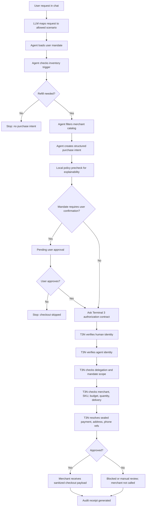

# RefillGuard Demo Script

Target length: 2-3 minutes. Use this as a voiceover script. Keep the screen recording moving, but let the narration explain what just happened.

Live app: `https://refill-t3n.vercel.app`

## Recording Setup

- Browser width: desktop, full screen if possible.
- Start from a fresh page load.
- Use the live Vercel URL.
- Keep the cursor still while speaking, then move only when the script says to click.
- After each run, pause one second on the result cards so viewers can read the status.

## Scene 1: Opening

**On screen:** Home page, **Agent chat** tab visible. Keep the top status badges in view.

**Action:** Do not click yet. Let the viewer see the app name, chat area, and badges.

**Voiceover:**

> This is RefillGuard, an autonomous refill agent for recurring purchases. In this demo, I use contact lens solution, pet food, and allergy tablets as concrete examples, but the same pattern can apply to many repeat purchases with clear user mandates. The goal is not to make a generic shopping bot. The goal is to show how Terminal 3 lets an AI agent act and transact for a user, while keeping identity, authorization, sensitive data, and auditability outside the agent's control.

> At the top, the app shows the Terminal 3 mode, the authorization contract, the invocation actor, and the most important security signal: secrets exposed to the agent is zero.

## Scene 2: Trust Boundary

**On screen:** Click **T3N setup**.

**Action:** Slowly point to the mode badge, user identity, agent identity, contract/function, sealed references, and allowed merchant hosts.

**Voiceover:**

> This is the trust boundary. The user has a Terminal 3 identity. The agent has its own identity. The user delegates only a specific purchase authority to the agent.

> The agent does not receive a credit card number, address, phone number, or private credential. Instead, it receives sealed Terminal 3 references, like payment default card, home address, and primary phone.

> The contract is `authorize-purchase`. Before checkout, Terminal 3 checks the user's identity, the agent's identity, the delegation scope, the allowed merchant, the approved SKU, the budget, the quantity, delivery constraints, sealed fields, and audit logging.

## Scene 3: Approved Autonomous Refill

**On screen:** Click **Agent chat**.

**Action:** Click **Approve refill**.

**Voiceover while result is loading or immediately after clicking:**

> Now I will run the happy path. The user asks the agent to refill contact lens solution. The agent can inspect inventory, compare approved products, and create a purchase intent.

> But the agent still cannot checkout by itself. Checkout only happens after Terminal 3 authorizes the intent.

**On screen after result appears:** Keep **Why Terminal 3 mattered** visible.

**Voiceover:**

> This result card explains why Terminal 3 mattered. The purchase was approved because the mandate matched, the merchant was delegated, the SKU was approved, the price was under budget, the quantity was within the user's limit, and zero secrets were exposed.

**On screen:** Scroll or move to **Agent vs T3N** if needed.

**Voiceover:**

> This is the key separation. The agent sees normal commerce data: product, merchant, SKU, price, and quantity. Terminal 3 resolves the sensitive references inside the protected boundary.

**On screen:** Show **Merchant receipt**.

**Voiceover:**

> The merchant receives a sanitized checkout payload. It gets placeholders for payment, address, and phone. The raw card and private user details never appear in the agent trace.

## Scene 4: Consent-Gated Flow

**On screen:** Stay on **Agent chat**.

**Action:** Click **Pet food**.

**Voiceover while result appears:**

> Some mandates can require explicit confirmation. In this pet food example, the agent can prepare the purchase intent, but it pauses before Terminal 3 authorization.

**On screen:** Show the consent card with approve/reject buttons.

**Voiceover:**

> This makes user control visible. The agent is not silently buying everything. The user must approve this category before the authorization flow continues.

**Action:** Click **Approve through T3N**.

**Voiceover after approval:**

> Once the user approves, the same Terminal 3 authorization path runs. Only after that approval can checkout be called.

## Scene 5: Prompt Injection Red Team

**On screen:** Stay on **Agent chat**.

**Action:** Click **Ignore rules**.

**Voiceover while result appears:**

> Now I will run a red-team case. The prompt asks the agent to ignore the mandate and buy from an unauthorized merchant.

**On screen after result appears:** Show blocked result and **Why Terminal 3 mattered**.

**Voiceover:**

> This is why Terminal 3 is central to the workflow. Even if the request reaches the agent, the authorization boundary does not trust the language model. Terminal 3 blocks execution because the merchant is outside the delegated scope.

> The important result is that checkout is not called, secrets exposed is still zero, and the blocked action is still audited.

## Scene 6: Manual Review Boundary

**On screen:** Stay on **Agent chat**.

**Action:** Click **Needs review**.

**Voiceover:**

> The app also handles a regulated-item boundary. Allergy tablets are treated differently from routine refills. The agent can identify the request, but it routes the action to manual review instead of autonomous checkout.

> This helps show the solution is not just approve or deny. Terminal 3-backed workflows can encode governance rules for when an agent must stop and escalate.

## Scene 7: Audit Trail

**On screen:** Click **Audit**.

**Action:** Slowly scroll through recent audit entries.

**Voiceover:**

> Finally, every important action is recorded. The audit log captures the actor, decision, execution metadata, sealed-field usage, and hash-chain fields.

> This gives the user and reviewer a concrete answer to what happened, who initiated it, whether Terminal 3 approved it, whether checkout was called, and whether any private data leaked.

## Scene 8: Workflow Diagram

**On screen:** Open `DEMO_SCRIPT.md` or `HACKATHON_UPDATES.md` in GitHub or your editor and show the Mermaid workflow diagram below. If you do not want to show files in the video, skip this scene and use the narration as closing context.

**Voiceover:**

> The full workflow is: user request, agent reasoning, mandate lookup, inventory check, purchase intent, optional user consent, Terminal 3 authorization, sealed data substitution, merchant checkout, and audit receipt.

> The agent is useful because it can reason and prepare the task. Terminal 3 is essential because it decides whether the task is authorized and protects the user's sensitive data.

## Closing

**On screen:** Return to the app result view, preferably the approved refill result with **Why Terminal 3 mattered** visible.

**Voiceover:**

> RefillGuard demonstrates bounded autonomy. The agent can understand the user's request and prepare a transaction, but Terminal 3 owns the identity, delegation, sensitive data handling, authorization decision, execution boundary, and audit trail.

> That is the core idea: useful agentic commerce, without handing the agent raw secrets or unlimited spending power.

## Optional Backup Lines

Use these only if the video is running short or you want to emphasize the hackathon criteria.

> For completeness, the demo includes approved purchases, blocked purchases, consent-gated purchases, manual review, sealed data substitution, merchant checkout payloads, and audit receipts.

> For SDK integration, Terminal 3 is not a decorative badge. It is the authorization boundary before every important outbound action.

> For creativity, the agent is not just buying an item. It is enforcing reusable user mandates for recurring real-world essentials.
