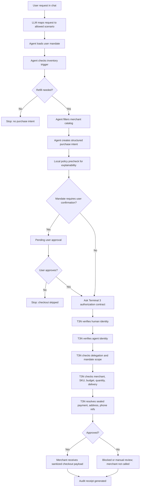

# RefillGuard Demo Script

Target length: under 4 minutes. Use this as a voiceover script. Keep the screen recording moving, and do not read the optional backup lines unless you have spare time.

Live app: `https://refill-t3n.vercel.app`

## Recording Setup

- Browser width: desktop, full screen if possible.
- Start from a fresh page load.
- Use the live Vercel URL.
- Keep the cursor still while speaking, then move only when the script says to click.
- After each run, pause one second on the result cards so viewers can read the status.

## Scene 1: Opening

**On screen:** Home page, **Agent chat** tab visible. Keep the top status badges in view.

**Action:** Do not click yet. Let the viewer see the app name, chat area, and badges.

**Voiceover:**

> This is RefillGuard, an autonomous refill agent for recurring purchases. I am using contact lens solution, pet food, and allergy tablets as examples, but the pattern works for many repeat purchases with clear user mandates.

> The key idea is simple: the agent can prepare a transaction, but Terminal 3 controls identity, authorization, sensitive data, and auditability. At the top, notice the contract, invocation actor, and secrets exposed: zero.

## Scene 2: Trust Boundary

**On screen:** Click **T3N setup**.

**Action:** Slowly point to the mode badge, user identity, agent identity, contract/function, sealed references, and allowed merchant hosts.

**Voiceover:**

> This is the trust boundary. The user has an identity, the agent has an identity, and the user delegates only specific purchase authority.

> The agent never sees a raw card, address, phone number, or credential. It only sees sealed Terminal 3 references. Before checkout, the `authorize-purchase` contract checks identity, scope, merchant, SKU, budget, quantity, delivery, sealed fields, and audit logging.

## Scene 3: Approved Autonomous Refill

**On screen:** Click **Agent chat**.

**Action:** Click **Approve refill**.

**Voiceover while result is loading or immediately after clicking:**

> Now I will run the happy path. The user asks for a contact lens solution refill. The agent checks inventory, compares approved products, and creates a purchase intent.

> But it still cannot checkout. Checkout only happens after Terminal 3 authorizes the intent.

**On screen after result appears:** Keep **Why Terminal 3 mattered** visible.

**Voiceover:**

> This card explains the result: mandate matched, merchant delegated, SKU approved, price and quantity within limits, checkout called, and secrets exposed remained zero.

**On screen:** Scroll or move to **Agent vs T3N** if needed.

**Voiceover:**

> The split is visible here. The agent sees product and merchant data. Terminal 3 resolves sensitive payment and delivery references.

**On screen:** Show **Merchant receipt**.

**Voiceover:**

> The merchant receives only a sanitized checkout payload, so raw private details never appear in the agent trace.

## Scene 4: Consent-Gated Flow

**On screen:** Stay on **Agent chat**.

**Action:** Click **Pet food**.

**Voiceover while result appears:**

> Some mandates require explicit confirmation. For pet food, the agent prepares the intent, then pauses before Terminal 3 authorization.

**On screen:** Show the consent card with approve/reject buttons.

**Voiceover:**

> This makes user control visible. The agent is not silently buying every category.

**Action:** Click **Approve through T3N**.

**Voiceover after approval:**

> After approval, the same Terminal 3 path runs, and only then can checkout happen.

## Scene 5: Prompt Injection Red Team

**On screen:** Stay on **Agent chat**.

**Action:** Click **Ignore rules**.

**Voiceover while result appears:**

> Now I will run a red-team case. The prompt asks the agent to ignore the mandate and buy from an unauthorized merchant.

**On screen after result appears:** Show blocked result and **Why Terminal 3 mattered**.

**Voiceover:**

> This is why Terminal 3 is central. The authorization boundary does not trust the language model. It blocks execution because the merchant is outside the delegated scope.

> Checkout is not called, secrets exposed is still zero, and the blocked action is audited.

## Scene 6: Manual Review Boundary

**On screen:** Stay on **Agent chat**.

**Action:** Click **Needs review**.

**Voiceover:**

> Allergy tablets show a manual-review boundary. The agent can identify the request, but it does not autonomously checkout regulated items.

> This shows the workflow can approve, block, or escalate depending on the user's mandate and risk rules.

## Scene 7: Audit Trail

**On screen:** Click **Audit**.

**Action:** Slowly scroll through recent audit entries.

**Voiceover:**

> Finally, every important action is recorded. The audit log captures actor, decision, execution metadata, sealed-field usage, and hash-chain fields.

> So a reviewer can see what happened, whether Terminal 3 approved it, whether checkout was called, and whether private data leaked.

## Scene 8: Workflow Diagram

**On screen:** Optional. Open `DEMO_SCRIPT.md` or `HACKATHON_UPDATES.md` in GitHub or your editor and show the Mermaid workflow diagram below. Skip this scene if the video is already close to 4 minutes.

**Voiceover:**

> The workflow is: user request, agent reasoning, mandate lookup, intent creation, optional consent, Terminal 3 authorization, sealed data substitution, merchant checkout, and audit.

> The agent prepares the task. Terminal 3 decides whether it is authorized and protects the user's sensitive data.

## Closing

**On screen:** Return to the app result view, preferably the approved refill result with **Why Terminal 3 mattered** visible.

**Voiceover:**

> RefillGuard demonstrates bounded autonomy. The agent understands the request and prepares the transaction, but Terminal 3 owns identity, delegation, sensitive data handling, authorization, execution boundaries, and audit.

> That is the core idea: useful agentic commerce, without handing the agent raw secrets or unlimited spending power.

## Optional Backup Lines

Use these only if the video is running short or you want to emphasize the hackathon criteria.

> For completeness, the demo includes approved purchases, blocked purchases, consent-gated purchases, manual review, sealed data substitution, merchant checkout payloads, and audit receipts.

> For SDK integration, Terminal 3 is not a decorative badge. It is the authorization boundary before every important outbound action.

> For creativity, the agent is not just buying an item. It is enforcing reusable user mandates for recurring real-world essentials.
