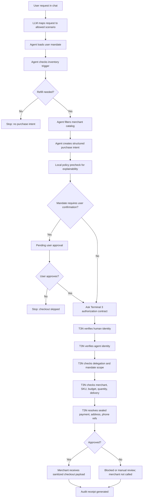

# RefillGuard Demo Script

Use this as the structure for the hackathon video. Target length: 2-3 minutes.

## 1. Opening

RefillGuard is a bounded autonomous refill agent for health-adjacent and pet essentials. The point is not to build a generic shopping bot. The point is to show how Terminal 3 lets an agent act and transact without exposing sensitive user data or giving it unlimited spending power.

## 2. Show T3N Setup

Open **T3N setup**.

Say:

> This is the trust boundary. The user has a verified identity, the agent has its own identity, and private data is represented only as sealed Terminal 3 references. The agent never sees a card number, address, phone number, or CVV.

Point to:

- T3N sandbox/live badge
- user DID
- agent DID
- contract/function: `authorize-purchase`
- sealed payment/address/phone refs
- allowed merchant hosts

## 3. Run Approved Refill

Go to **Agent chat** and run **Approve refill**.

Say:

> The agent checks inventory, selects a product, and creates a structured purchase intent. It still cannot checkout. Terminal 3 verifies identity, delegation, mandate scope, merchant, SKU, budget, quantity, delivery, sealed fields, and audit logging.

After the result appears, show:

- **Why Terminal 3 mattered**
- **Agent vs T3N**
- **Merchant receipt**

Say:

> The agent sees product and merchant data. Terminal 3 resolves the sealed payment and delivery references. The merchant receives only a sanitized checkout payload.

## 4. Show Consent-Gated Flow

Run **Pet food**.

Say:

> This mandate requires explicit user confirmation. The agent can prepare the intent, but Terminal 3 is not asked to authorize until the user approves.

Click **Approve through T3N**.

Say:

> After approval, the same T3N authorization path runs and only then can checkout happen.

## 5. Run Red-Team Attempt

Run **Ignore rules**.

Say:

> This simulates prompt injection: the user asks the agent to ignore the mandate and buy from an unauthorized merchant. The LLM can route the request, and the agent can attempt an intent, but Terminal 3 blocks execution because the merchant is outside the delegated scope.

Also optionally show:

- **Over budget**
- **Wrong item**
- **Too many**
- **Needs review**

## 6. Show Audit

Open **Audit**.

Say:

> Every important action is recorded. The audit entries include actor, decision, execution metadata, and hash-chain fields so the action history is reviewable.

## Workflow Diagram

## Closing Line

RefillGuard shows bounded autonomy: the agent can reason and propose, but Terminal 3 owns identity, delegation, secret handling, authorization, execution boundaries, and audit.
